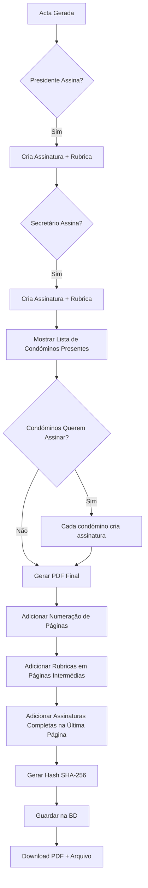

# 📜 Sistema de Assinaturas Legais para Actas de Assembleia

## 📋 Requisitos Legais Portugueses

### 1. **Assinaturas Obrigatórias** (Art. 19.º LPH)
- ✅ **Presidente da Mesa** - OBRIGATÓRIO
- ✅ **Secretário da Mesa** - OBRIGATÓRIO

### 2. **Assinaturas Opcionais**
- 📝 **Condóminos Presentes** - Podem solicitar assinar
- 📝 **Representantes** - Se aplicável

### 3. **Requisitos para Múltiplas Páginas**

#### 3.1. Numeração de Páginas
```
Página 1 de 5
Página 2 de 5
...
Página 5 de 5
```

#### 3.2. Rubricas em TODAS as Páginas
- **Quem rubrica**: Presidente + Secretário
- **Onde**: Canto inferior direito de cada página
- **Formato**: Iniciais ou rubrica reduzida

#### 3.3. Assinatura Completa
- **Onde**: Última página APENAS
- **Quem**: Presidente, Secretário, Condóminos (se solicitarem)

#### 3.4. Selo/Carimbo (Opcional mas Recomendado)
- **Tipo**: "ACTA DE ASSEMBLEIA - CONDOMÍNIO [NOME]"
- **Localização**: Primeira página ou todas as páginas

---

## 🏗️ Arquitetura da Solução

### Base de Dados

#### Tabela: `minute_signatures`
```sql
CREATE TABLE minute_signatures (
  id UUID PRIMARY KEY DEFAULT uuid_generate_v4(),
  minute_id UUID NOT NULL REFERENCES minutes(id) ON DELETE CASCADE,
  member_id UUID REFERENCES members(id),
  signer_type VARCHAR(50) NOT NULL, -- 'president', 'secretary', 'member'
  signer_name VARCHAR(255) NOT NULL,
  signature TEXT NOT NULL, -- Base64 PNG da assinatura completa
  rubric TEXT, -- Base64 PNG da rubrica (para páginas intermédias)
  signed_at TIMESTAMP DEFAULT NOW(),
  ip_address VARCHAR(45),
  user_agent TEXT,
  created_at TIMESTAMP DEFAULT NOW()
);
```

### Componentes Frontend

#### 1. `FirmasActaStep.tsx` (Modificado)
```typescript
interface Signature {
  type: 'president' | 'secretary' | 'member';
  name: string;
  signature: string; // Assinatura completa
  rubric: string; // Rubrica para páginas intermédias
  signedAt: string;
}

const [signatures, setSignatures] = useState<Signature[]>([]);
const [presentMembers, setPresentMembers] = useState<Member[]>([]);
```

#### 2. `RubricDialog.tsx` (NOVO)
```typescript
// Modal para criar rubrica (menor que assinatura completa)
// Usado para assinar páginas intermédias
```

#### 3. `PDF Generator` (Modificado)
```typescript
// Função para gerar PDF com:
// - Numeração de páginas
// - Rubricas em todas as páginas (exceto última)
// - Assinaturas completas na última página
```

---

## 📄 Formato Legal da Acta (Exemplo)

### Página 1 de 3
```
ACTA N.º 31
ASSEMBLEIA EXTRAORDINÁRIA DE CONDÓMINOS
Condomínio Buraca 1

[Conteúdo da acta...]

________________________________
[Rubrica Presidente]  [Rubrica Secretário]
                                         Página 1 de 3
```

### Página 2 de 3
```
[Continuação do conteúdo...]

________________________________
[Rubrica Presidente]  [Rubrica Secretário]
                                         Página 2 de 3
```

### Página 3 de 3
```
[Continuação do conteúdo...]

Nada mais havendo a tratar, foi encerrada a sessão...

ASSINATURAS:

_____________________________        _____________________________
João Silva                            Maria Santos
Presidente da Mesa                   Secretária da Mesa
Data: 26/10/2025                     Data: 26/10/2025

CONDÓMINOS PRESENTES QUE SOLICITARAM ASSINAR:

_____________________________        _____________________________
António Pereira                      Carlos Rodrigues
Fração A                             Fração B

                                         Página 3 de 3 [ÚLTIMA]
```

---

## ⚖️ Base Legal

### Código Civil Português
- **Art. 1430º**: Quórum e maiorias
- **Art. 1431º**: Deliberações da assembleia
- **Art. 1432º**: Convocação da assembleia

### Lei de Propriedade Horizontal (Dec-Lei 267/94)
- **Art. 16º**: Assembleia de condóminos
- **Art. 17º**: Competências da assembleia
- **Art. 19º**: "A acta da reunião deve ser assinada pelo presidente e pelo secretário da mesa"
- **Art. 20º**: Livro de actas

### Legislação Complementar
- **Lei n.º 8/2022**: RGPD - Proteção de dados
- **Regulamento (UE) n.º 910/2014**: eIDAS - Assinaturas eletrónicas

---

## 🔐 Segurança e Validação

### 1. Integridade do Documento
- **Hash SHA-256** de cada página
- **Hash global** do documento completo
- **Timestamp** de criação

### 2. Não-Repúdio
- **IP Address** de quem assinou
- **User Agent** (browser/device)
- **Data/hora exata**

### 3. Arquivo
- **PDF/A** para arquivo de longo prazo
- **Backup automático** em múltiplas localizações
- **Log de auditoria** de todas as assinaturas

---

## ✅ Checklist de Implementação

### Fase 1: Assinaturas dos Condóminos
- [ ] Modificar `FirmasActaStep.tsx`
- [ ] Adicionar lista de condóminos presentes
- [ ] Checkbox "Desejo assinar a acta"
- [ ] Criar tabela `minute_signatures` na BD
- [ ] Endpoint API para guardar assinaturas

### Fase 2: Rubricas em Páginas Intermédias
- [ ] Criar componente `RubricDialog.tsx`
- [ ] Permitir criar rubrica (menor que assinatura)
- [ ] Guardar rubrica separadamente da assinatura

### Fase 3: Geração de PDF Legal
- [ ] Calcular número total de páginas
- [ ] Adicionar numeração "Página X de Y"
- [ ] Inserir rubricas em páginas intermédias
- [ ] Inserir assinaturas completas na última página
- [ ] Adicionar selo/carimbo (opcional)

### Fase 4: Validação e Segurança
- [ ] Gerar hash SHA-256 de cada página
- [ ] Criar hash global do documento
- [ ] Guardar metadados de assinatura (IP, User-Agent)
- [ ] Log de auditoria completo

---

## 📊 Fluxo de Assinatura



---

**Última atualização**: 26 Outubro 2025
**Versão**: 1.0
**Responsável**: Sistema Gestor de Condomínios
