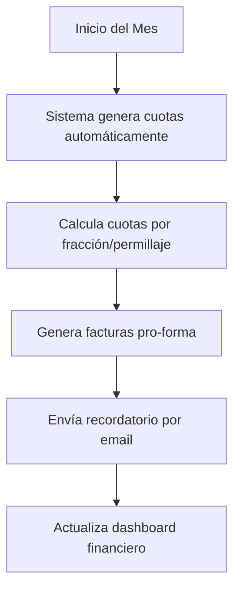
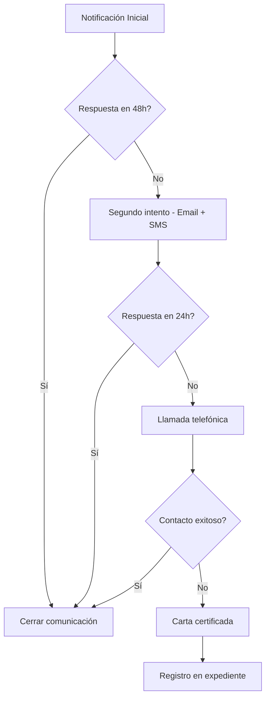
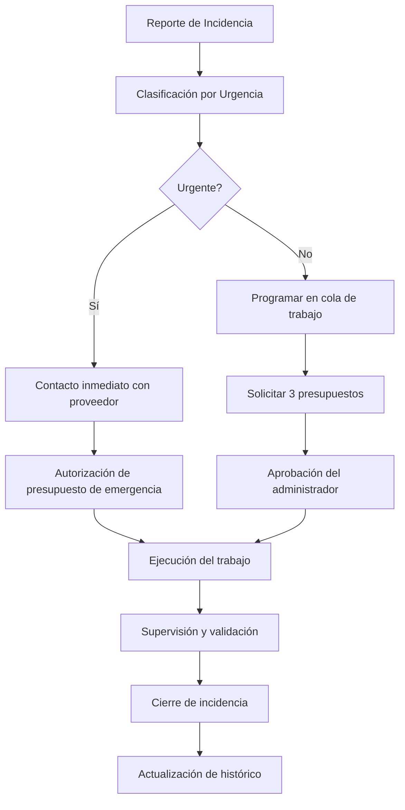

# 🏢 Flujos de Trabajo para Gestión de Condominio
## Sistema Integral de Gestión - Condomino Buraca 1

---

## 📊 Análisis del Sistema Actual

### Módulos Existentes:
1. **Dashboard** - Vista general del condominio
2. **Convocatorias** - Gestión de asambleas
3. **Actas** - Registro de reuniones
4. **Finanzas** - Control económico
5. **Miembros** - Gestión de propietarios
6. **Documentos** - Archivo digital
7. **Comunicaciones** - Mensajería y notificaciones
8. **Mantenimiento** - Control de servicios
9. **Reportes** - Informes y estadísticas
10. **Tareas** - Gestión de actividades

---

## 🔄 FLUJOS DE TRABAJO PROPUESTOS

## 1️⃣ FLUJO FINANCIERO COMPLETO

### 📅 Proceso Mensual Automatizado

#### **Día 1 del mes:**


#### **Día 5 del mes:**
- ✉️ **Envío automático de facturas** por email a todos los propietarios
- 📱 **Notificación SMS** opcional para propietarios que lo soliciten
- 📊 **Actualización del portal** con facturas disponibles para descarga

#### **Día 15 del mes:**
- ⚠️ **Recordatorio automático** a quienes no han pagado
- 📈 **Informe de cobros** al administrador
- 🔔 **Alerta de morosidad** temprana

#### **Día 25 del mes:**
- 🚨 **Segunda notificación** con recargo por mora (según regulamento)
- 📋 **Lista de morosos** para revisión del administrador
- 📧 **Preparación de cartas** de cobranza formal

#### **Fin de mes:**
- 📊 **Cierre contable** automático
- 📈 **Generación de informes** mensuales
- 💾 **Backup automático** de datos financieros
- 📑 **Preparación de documentación** para contabilidad

### 💰 Gestión de Pagos

```javascript
// Flujo de procesamiento de pagos
const procesarPago = async (pago) => {
  // 1. Registrar pago
  await registrarTransaccion(pago);
  
  // 2. Actualizar saldo del propietario
  await actualizarSaldo(pago.memberId);
  
  // 3. Enviar confirmación
  await enviarRecibo(pago);
  
  // 4. Actualizar dashboard
  await actualizarMetricas();
  
  // 5. Si hay saldo pendiente anterior, aplicar pago
  await aplicarPagosPendientes(pago.memberId);
};
```

### 📊 Indicadores Financieros Clave (KPIs)
- **Tasa de cobro**: % de cuotas cobradas vs emitidas
- **Morosidad**: Propietarios con deuda > 30 días
- **Cash flow**: Flujo de caja proyectado a 3 meses
- **Reservas**: Estado del fondo de reserva obligatorio

---

## 2️⃣ FLUJO DE COMUNICACIONES Y NOTIFICACIONES

### 📬 Sistema de Comunicación Multicanal

#### **Canales Disponibles:**
1. **Email** - Principal, con plantillas personalizables
2. **SMS** - Para urgencias y recordatorios
3. **Portal Web** - Notificaciones en la aplicación
4. **WhatsApp Business API** - Mensajería instantánea
5. **Cartas físicas** - Para comunicaciones legales

### 🔔 Tipos de Notificaciones

#### **URGENTES (Inmediatas):**
- 🚨 Averías graves (agua, electricidad, ascensor)
- 🔥 Emergencias de seguridad
- ⚡ Cortes de servicios programados
- 🚪 Incidencias que requieren acceso a viviendas

#### **IMPORTANTES (24-48h):**
- 📅 Convocatorias de asambleas
- 💰 Avisos de pago
- 📋 Cambios en normativas
- 🔧 Mantenimientos programados

#### **INFORMATIVAS (Semanales):**
- 📊 Resumen de actividades
- 📈 Estado financiero
- 🎉 Eventos comunitarios
- 📝 Actualizaciones del condominio

### 📧 Plantillas de Comunicación

```typescript
// Plantilla de notificación automática
interface NotificationTemplate {
  tipo: 'urgente' | 'importante' | 'informativa';
  asunto: string;
  contenido: string;
  variables: string[]; // {{nombre}}, {{fecha}}, {{importe}}, etc.
  canales: ('email' | 'sms' | 'whatsapp' | 'portal')[];
  programacion?: {
    fecha?: Date;
    recurrencia?: 'diaria' | 'semanal' | 'mensual';
  };
}
```

### 📊 Flujo de Escalado de Comunicaciones



---

## 3️⃣ FLUJO DE MANTENIMIENTO Y PROVEEDORES

### 🔧 Gestión Preventiva y Correctiva

#### **Mantenimiento Preventivo (Programado):**

**MENSUAL:**
- 🧹 Limpieza de zonas comunes
- 🌳 Jardinería
- 💡 Revisión de iluminación
- 🗑️ Gestión de residuos

**TRIMESTRAL:**
- 🔌 Revisión eléctrica
- 🚪 Mantenimiento de puertas automáticas
- 🏊 Tratamiento de piscina (si aplica)
- 🧯 Revisión de extintores

**SEMESTRAL:**
- 🛗 Inspección de ascensores
- 🏠 Revisión de cubiertas y bajantes
- 🎨 Evaluación de pintura
- 📡 Mantenimiento de antenas

**ANUAL:**
- 🔥 Certificación de sistemas contra incendios
- ⚡ Inspección eléctrica oficial
- 🏗️ Evaluación estructural
- 📋 Actualización de seguros

### 🚨 Mantenimiento Correctivo (Incidencias)



### 👷 Gestión de Proveedores

**Base de Datos de Proveedores:**
- 📇 Datos completos (NIF, seguros, certificaciones)
- ⭐ Sistema de valoración (1-5 estrellas)
- 📊 Histórico de trabajos realizados
- 💰 Comparativa de precios
- 📅 Disponibilidad y tiempos de respuesta
- 📝 Contratos y garantías vigentes

**Proceso de Selección:**
1. **Solicitud de presupuestos** (mínimo 3 para trabajos > 500€)
2. **Evaluación comparativa** (precio, calidad, tiempo)
3. **Verificación de documentación** (seguros, certificados)
4. **Aprobación según importe:**
   - < 500€: Administrador
   - 500-3000€: Comisión de obras
   - > 3000€: Asamblea

---

## 4️⃣ FLUJO DE ASAMBLEAS Y DOCUMENTACIÓN LEGAL

### 📅 Proceso Completo de Asamblea

#### **30 días antes:**
- 📋 Preparación del orden del día
- 📊 Recopilación de informes y presupuestos
- 📧 Envío de pre-convocatoria para sugerencias

#### **15 días antes (Plazo legal mínimo):**
- 📮 Envío oficial de convocatoria (email certificado + portal)
- 📎 Adjuntar documentación relevante
- 🗳️ Habilitación de voto delegado online

#### **7 días antes:**
- 📞 Recordatorio por múltiples canales
- 📋 Publicación de documentos adicionales
- ❓ Periodo de preguntas y aclaraciones online

#### **Día de la asamblea:**
- ✅ Check-in digital de asistentes
- 📹 Streaming online (opcional)
- 🗳️ Sistema de votación electrónica
- 📝 Grabación y transcripción automática

#### **48h después:**
- 📄 Borrador del acta disponible
- 💬 Periodo de comentarios (5 días)
- ✍️ Firma digital del acta
- 📧 Distribución del acta firmada

### 📑 Gestión Documental

**Documentos Obligatorios:**
- 📕 Libro de actas digitalizado
- 📗 Libro de cuentas
- 📘 Registro de propietarios actualizado
- 📙 Pólizas de seguro vigentes
- 📓 Contratos de servicios
- 📔 Certificados técnicos

**Sistema de Archivo:**
```
/documentos
  /actas
    /2025
      - acta_001_ordinaria_febrero.pdf
      - acta_002_extraordinaria_marzo.pdf
  /financiero
    /2025
      /facturas
      /presupuestos
      /cierres_mensuales
  /legal
    - escritura_constitucion.pdf
    - reglamento_interno.pdf
    - ley_propiedad_horizontal.pdf
  /contratos
    - limpieza_2025.pdf
    - ascensores_2025.pdf
    - jardineria_2025.pdf
  /seguros
    - poliza_multirriesgo_2025.pdf
    - rc_administrador.pdf
```

---

## 5️⃣ FLUJO DE CUMPLIMIENTO LEGAL (PORTUGAL)

### ⚖️ Obligaciones Legales Automatizadas

#### **MENSUAL:**
- 📊 Preparación de balancetes
- 💰 Pago de servicios comunes
- 📋 Actualización de lista de morosos

#### **TRIMESTRAL:**
- 📈 Informe financiero trimestral
- 🏦 Declaración de IVA (si aplica)
- 📊 Revisión del fondo de reserva

#### **ANUAL:**
- 📋 Convocatoria de asamblea ordinaria obligatoria
- 💼 Presentación y aprobación de cuentas
- 📊 Presupuesto del año siguiente
- 🏢 Actualización del RNPC (si está registrado)
- 📑 Modelo 39 (declaración fiscal)
- 🔥 Renovación del seguro contra incendios

### 🚨 Alertas de Cumplimiento

```javascript
// Sistema de alertas legales
const alertasLegales = {
  seguroIncendios: {
    diasAntes: 30,
    mensaje: "El seguro contra incendios vence en 30 días",
    accion: "Renovar póliza obligatoria"
  },
  asambleaOrdinaria: {
    diasAntes: 60,
    mensaje: "Preparar asamblea ordinaria anual",
    accion: "Iniciar proceso de convocatoria"
  },
  cuentasAnuales: {
    diasAntes: 45,
    mensaje: "Cerrar cuentas del ejercicio",
    accion: "Preparar documentación contable"
  },
  fondoReserva: {
    mensual: true,
    mensaje: "Verificar dotación al fondo de reserva",
    minimoLegal: "10% del presupuesto anual"
  }
};
```

---

## 6️⃣ AUTOMATIZACIONES INTELIGENTES CON IA

### 🤖 Asistente Virtual del Condominio

#### **Funciones Automáticas:**

1. **Chatbot 24/7** para consultas frecuentes:
   - Saldo de cuotas
   - Horarios de servicios
   - Normativas del edificio
   - Estado de incidencias

2. **Procesamiento de Documentos:**
   - OCR de facturas recibidas
   - Clasificación automática
   - Extracción de datos clave
   - Archivo inteligente

3. **Análisis Predictivo:**
   - Predicción de morosidad
   - Detección de patrones de gasto
   - Optimización de contratos
   - Alertas de mantenimiento preventivo

4. **Generación Automática:**
   - Actas desde grabaciones
   - Informes mensuales
   - Cartas de cobranza
   - Respuestas a consultas comunes

---

## 7️⃣ PORTAL DEL PROPIETARIO

### 🏠 Funcionalidades del Portal Web/App

#### **Área Privada del Propietario:**

**CONSULTAS:**
- 📊 Estado de cuenta personal
- 📄 Histórico de pagos
- 📋 Documentos del condominio
- 📅 Calendario de eventos
- 🔧 Estado de incidencias reportadas

**ACCIONES:**
- 💳 Pagar cuotas online
- 📝 Reportar incidencias con fotos
- 🗳️ Votar en decisiones online
- 📧 Actualizar datos de contacto
- 💬 Comunicarse con administración
- 📥 Descargar documentos fiscales

**NOTIFICACIONES PERSONALIZADAS:**
- 🔔 Cuotas próximas a vencer
- 📅 Próximas asambleas
- 🚧 Obras que afectan su propiedad
- 💰 Confirmación de pagos recibidos
- 📊 Resumen mensual del condominio

---

## 8️⃣ DASHBOARD DE CONTROL PARA EL ADMINISTRADOR

### 📊 KPIs en Tiempo Real

```typescript
interface DashboardMetrics {
  // Financiero
  ingresosMes: number;
  gastosMes: number;
  tasaCobro: number; // porcentaje
  morosidad: number; // porcentaje
  fondoReserva: number;
  
  // Operacional
  incidenciasAbiertas: number;
  tiempoResolucionMedio: number; // horas
  satisfaccionPropietarios: number; // 1-5
  
  // Cumplimiento
  documentosPendientes: string[];
  proximosVencimientos: Date[];
  alertasLegales: Alert[];
  
  // Comunicaciones
  mensajesNoLeidos: number;
  tasaRespuesta: number; // porcentaje
  canalMasUsado: string;
}
```

### 📈 Informes Automáticos

**DIARIOS:**
- Movimientos bancarios
- Incidencias nuevas
- Pagos recibidos

**SEMANALES:**
- Resumen de actividad
- Trabajos programados
- Comunicaciones enviadas

**MENSUALES:**
- Cierre contable
- Análisis de morosidad
- Informe de mantenimiento
- Métricas de satisfacción

---

## 9️⃣ INTEGRACIÓN CON SERVICIOS EXTERNOS

### 🔗 APIs y Conexiones

1. **Bancarias:**
   - Importación automática de movimientos
   - Conciliación bancaria
   - Pagos por referencia MB

2. **Fiscales:**
   - Facturación electrónica
   - Comunicación con AT (Autoridade Tributária)
   - Generación de e-facturas

3. **Comunicaciones:**
   - Servicio de SMS (Twilio)
   - Email transaccional (SendGrid)
   - WhatsApp Business API
   - Certificación de comunicaciones

4. **Utilidades:**
   - Lecturas de contadores inteligentes
   - Gestión de accesos (intercomunicadores)
   - Cámaras de seguridad
   - Sensores IoT (temperatura, humedad, etc.)

---

## 🚀 PLAN DE IMPLEMENTACIÓN

### Fase 1 (Mes 1-2): Base
- ✅ Configuración inicial del sistema
- ✅ Migración de datos existentes
- ✅ Formación del administrador
- ✅ Configuración de usuarios

### Fase 2 (Mes 2-3): Financiero
- 💰 Automatización de cuotas
- 📊 Integración bancaria
- 📧 Notificaciones de pago
- 📈 Informes básicos

### Fase 3 (Mes 3-4): Comunicaciones
- 📬 Sistema de notificaciones
- 💬 Chat integrado
- 📱 App móvil
- 🌐 Portal del propietario

### Fase 4 (Mes 4-5): Mantenimiento
- 🔧 Gestión de incidencias
- 👷 Base de proveedores
- 📅 Mantenimiento preventivo
- 📊 Históricos y reportes

### Fase 5 (Mes 5-6): Optimización
- 🤖 IA y automatizaciones
- 📈 Análisis predictivo
- 🔄 Integraciones avanzadas
- 📊 Dashboard ejecutivo

---

## 📋 CHECKLIST DE IMPLEMENTACIÓN

### Para el Administrador:
- [ ] Definir estructura de cuotas y permillajes
- [ ] Configurar calendario de cobros
- [ ] Establecer protocolos de comunicación
- [ ] Crear plantillas de documentos
- [ ] Definir niveles de autorización
- [ ] Configurar alertas y recordatorios
- [ ] Establecer procedimientos de emergencia

### Para los Propietarios:
- [ ] Registro en el portal
- [ ] Actualización de datos de contacto
- [ ] Configuración de preferencias de notificación
- [ ] Activación de pagos online
- [ ] Descarga de app móvil
- [ ] Formación básica del sistema

### Para Proveedores:
- [ ] Alta en el sistema
- [ ] Carga de documentación
- [ ] Configuración de disponibilidad
- [ ] Acceso al portal de proveedores
- [ ] Protocolo de facturación
- [ ] Sistema de valoración

---

## 💡 BENEFICIOS ESPERADOS

### Eficiencia Operativa:
- ⏱️ **80% reducción** en tiempo de gestión administrativa
- 📈 **95% tasa de cobro** en los primeros 10 días
- 🔧 **50% reducción** en tiempo de resolución de incidencias
- 📊 **100% trazabilidad** de todas las operaciones

### Satisfacción:
- 😊 **Mayor transparencia** en la gestión
- 📱 **Acceso 24/7** a información
- 💬 **Comunicación directa** y efectiva
- 🏠 **Mejor calidad de vida** en el condominio

### Cumplimiento Legal:
- ✅ **100% cumplimiento** de obligaciones legales
- 📋 **Documentación siempre actualizada**
- 🔒 **Seguridad jurídica** en todas las decisiones
- 📊 **Auditoría continua** del estado del condominio

---

## 📞 SOPORTE Y MANTENIMIENTO

### Niveles de Soporte:
1. **Nivel 1**: Chatbot y FAQ (inmediato)
2. **Nivel 2**: Soporte por email (< 24h)
3. **Nivel 3**: Soporte telefónico (< 4h)
4. **Nivel 4**: Soporte presencial (< 48h)

### Actualizaciones:
- 🔄 **Mensuales**: Corrección de errores
- 📈 **Trimestrales**: Nuevas funcionalidades
- 🎯 **Anuales**: Actualizaciones mayores
- ⚖️ **Inmediatas**: Cambios legales

---

*Documento actualizado: Septiembre 2025*
*Versión: 1.0*
*Sistema: Gestor Condominios - Condomino Buraca 1*